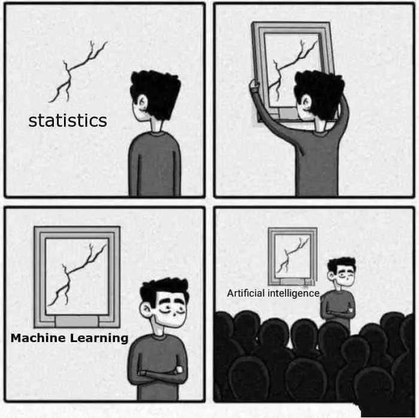
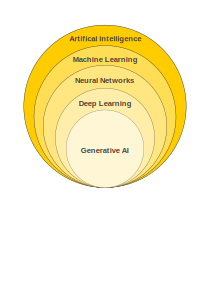
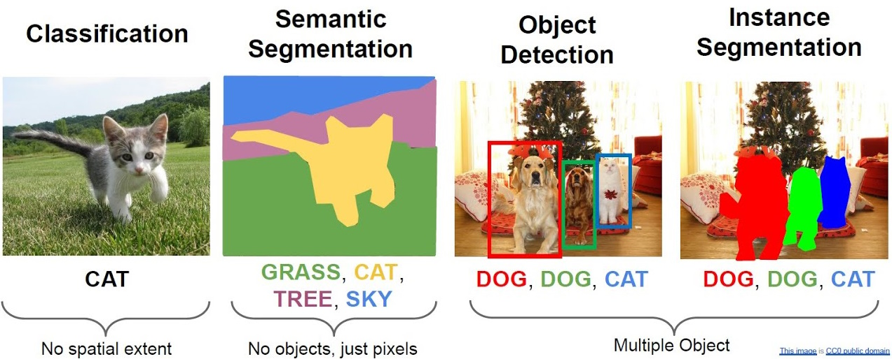

# What is Machine Learning? {.r-fit-text}

## Is ML just statistics? {.center}



## Is ML just statistics?

What do we use statistics for?

::: {.incremental}
- Exploration
- Confirmation
- Prediction
:::

```{r loadpacks, echo=FALSE}
library(ggplot2)
library(GGally)
library(tidyfit)
library(randomForest)
```


## Is ML just statistics?

What do we use statistics for?


- Exploration
- Confirmation
- **Prediction**

## {.center}

::: {.r-fit-text}
*Confidence* vs. *Accuracy*
:::

## Is this a good model?

```{r goodbadmodel, echo=FALSE}
set.seed(45)
n <- 1000
x <- runif(n,0,100)
res <- rnorm(n,0,100)
y <- 0.5 + 0.4 * x + res

df <- data.frame(x=x,y=y)

m <- lm(y ~ x, data = df)

summary(m)
```
##

```{r plot goodbadmodel, echo=FALSE}
ggplot(df,aes(x,y)) + geom_point() + geom_smooth(method='lm')
```
## 

```{r obsvspred, echo=FALSE}
df$pred <- predict(m)
ggplot(df,aes(y,pred)) + geom_point() +
    geom_smooth(method='lm',se=FALSE) +
    xlab('Observed') + ylab('Predicted')
```
## Machine Learning vs. Statistics

- It's all about good predictions
- Forget p-values, confidence intervals, model assumptions
- Forget (mostly) about **model interpretation**
- Forget about the 'minimal' model and parsimony - use ALL the data
- The best ML methods don't care about linearity, normality, collinearity, etc.
- Many good statistical methods (e.g. linear models) are bad ML approaches

## Example: Boston Housing Price

```{r BHPload, echo=FALSE}
data <- MASS::Boston
str(data)
```

## Linear Regression vs Random Forests

```{r lmvsrf, echo=FALSE}
# For reproducibility
set.seed(128)
ix_tst <- sample(1:nrow(data), round(nrow(data)*0.1))

data_trn <- data[-ix_tst,]
data_tst <- data[ix_tst,]

model_frame <- data_trn %>% 
  regress(medv ~ .,
          OLS = m("lm"),
          RF = m("rf")
          )

model_frame %>% 
  # Generate predictions
  predict(data_tst) %>% 
  # Calculate RMSE
  yardstick::rmse(truth, prediction)
```
# ML Concepts

## Terminology



## Terminology

- **Training:** calculating model parameters from data. 
- **Tuning:** optimizing model *hyperparameters*  for best prediction.
- **Validating:** evaluation while tuning.
- **Testing:** final evaluation of the resulting model.
- **Outcome:** our dependent variable
- **Feature:** our predictor variables

## Terminology

- **Classification:** any problem/model that outputs *categorical* data.
    - In ML, logistic *regression*  is a  *classification**  algorithm
- **Regression:** any problem/model that outputs *continuous* data

When dealing with images:


# Machine Learning Club

## ML Club rules

1. You do talk about ML Club.
2. ML Club is not "Thiago's unofficial taught module on Machine Learning"
3. ...
4. ...

## Now what?

- What do we want ML club to be? (15min) 
- What should be the format of the meetings? (15 min)
- Topics for the next meetings (10 min).
